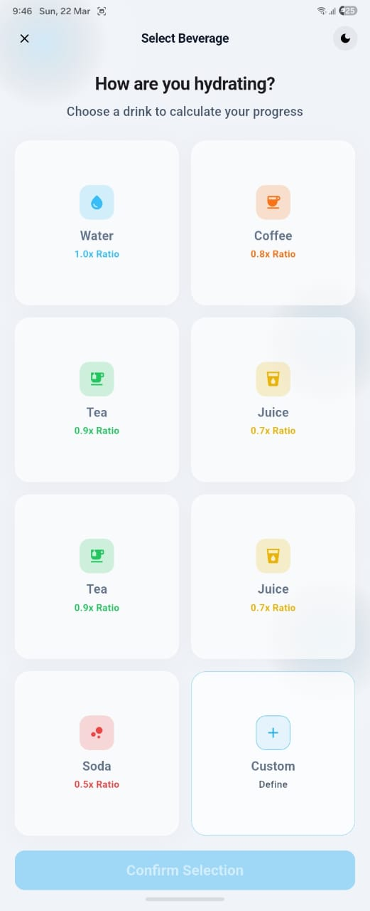
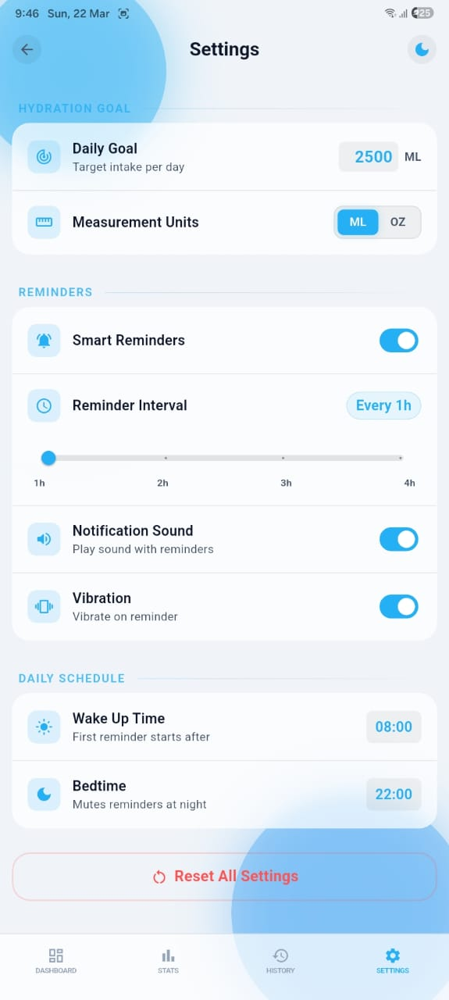
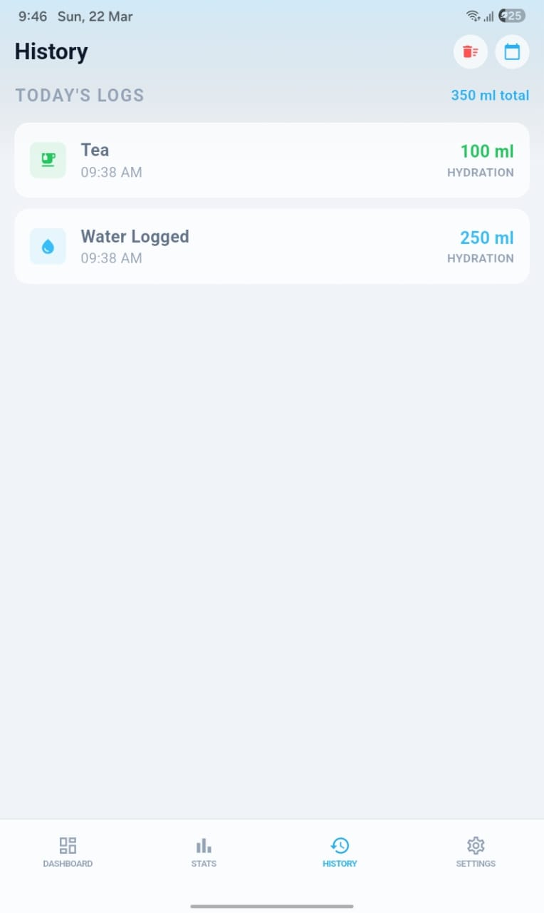
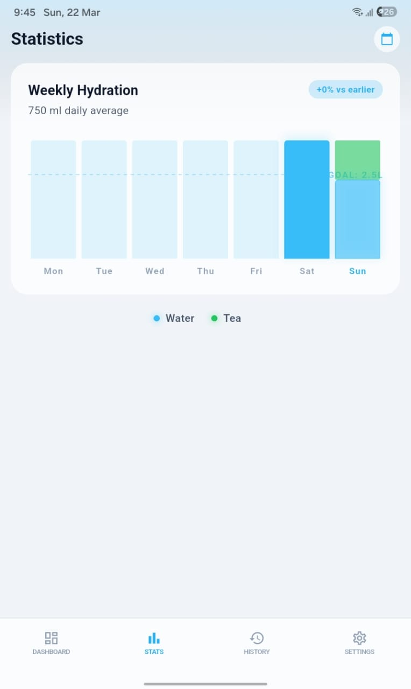
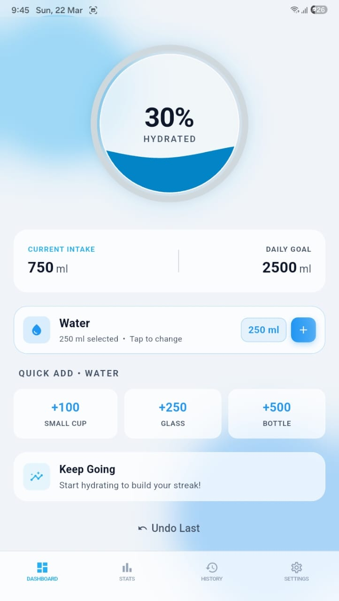

<div align="center">
  
  <h1>Water Reminder & Hydration Tracker 💧</h1>
  <p><b>A beautiful, intelligent Flutter application to help you stay hydrated through smart tracking and precise background reminders.</b></p>
  <p><i>Developed with ❤️ by <b>Gaurav Pandey</b></i></p>
</div>

---

## 📸 Screenshots

<div align="center">
  
  
  
  
  
</div>

<br/>

## 🌟 Key Features

### 🥤 Intelligent Beverage Tracking
Track more than just water! The app supports **Water, Coffee, Tea, Milk, Juice, Soda, and Custom liquids**. It automatically calculates the *true hydration multiplier* of different beverages. For example, caffeinated drinks like coffee add less effective hydration than pure water, giving you a scientifically accurate hydration score.

### 🎨 Stunning Premium UI & Animations
Built with premium aesthetics in mind. Enjoy sleek dark/light themes, glassmorphism UI elements, smooth fluid transitions, and a delightful confetti burst celebration when you hit your daily hydration goal!

### ⏰ Precise Background Reminders
Never miss a glass of water again.
*   Schedules exact-timing notifications using Android 12+ `SCHEDULE_EXACT_ALARM` APIs.
*   Works flawlessly in the background, bypassing aggressive battery optimizations (Doze mode).
*   Gracefully falls back to inexact alarms on restricted/older devices so reminders never silently fail.
*   Alarms survive and automatically restore after device reboots.

### ⚙️ Granular User Controls
Completely customize your notification experience:
*   Toggle notification **Sound** and **Vibration** right from settings.
*   Set your **Sleep and Wake boundaries** so you are never disturbed at night.
*   Configure the exact hourly interval between your daily alerts.

### 📅 History & Calendar Trends
Visualize your progress over time! View your hydration trends using an interactive calendar heat-map, which shows you exactly how much you drank and what your daily goal completion was on any given day.

---

## 🛠️ Technical Stack

*   **Framework:** [Flutter](https://flutter.dev/) (Dart)
*   **State Management:** `provider` architecture
*   **Local Storage:** `shared_preferences` for fast, offline, persistent settings and water logs.
*   **Background Tasks:** `flutter_local_notifications` & `timezone`

## 🚀 Getting Started

If you want to run or contribute to this project locally:

1.  **Ensure you have Flutter installed** matching the version in `pubspec.yaml` (>=3.38.4).
2.  Clone this repository:
    ```bash
    git clone https://github.com/gaurav0219/water_reminder.git
    ```
3.  Navigate to the directory and install dependencies:
    ```bash
    cd water_reminder
    flutter pub get
    ```
4.  Run the application on a connected device or emulator:
    ```bash
    flutter run
    ```

## 📈 Roadmap

- [x] Precise alarm implementation
- [x] Custom liquids and real hydration math
- [x] Advanced UI and Confetti celebrations
- [ ] Weekly/Monthly detailed charts
- [ ] Connect with Google Fit / Apple Health

## 🤝 Contributing

Feel free to fork this project, open an issue, or submit a pull request if you want to improve the app, add new beverages, or translate it into another language!

## 📄 License
This project is open-source and available under the MIT License.
